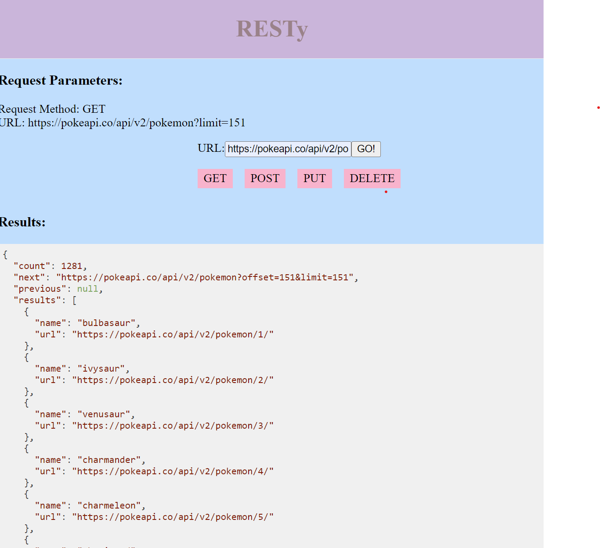
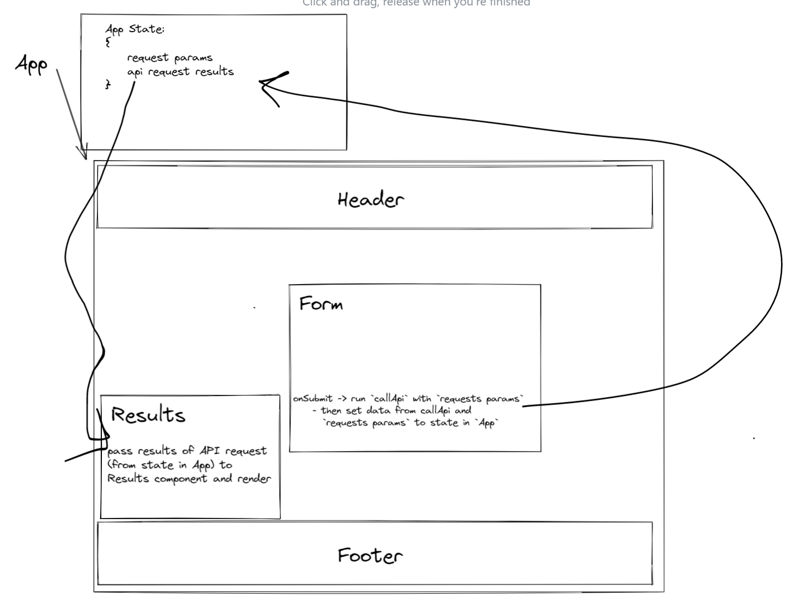

# RESTy

## Author

- Rhea Carillo

## Overview

REST-y is a React app that allow users to input well-formatted RESTful API requests and see the results.

## Live Site

[Click to try RESTy here](https://rhea-resty.netlify.app/)

## Running the app

- clone REST-y to you local machine
- run `npm start` to start an instance of the REST-y React App
- enter an API request and click 'GO!' to see API request results

## UML

